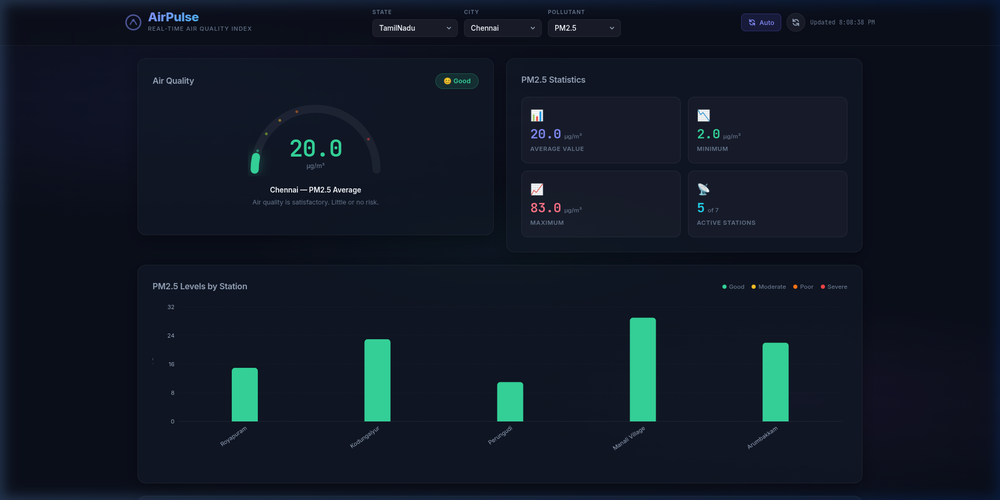
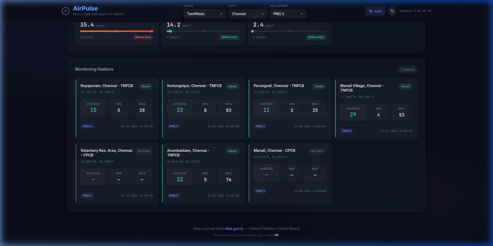

<p align="center">
  
</p>

<p align="center">
  <a href="#-features"></a>
  <a href="#-tech-stack"></a>
  <a href="#-quick-start"></a>
  <a href="#-api-endpoints"></a>
</p>

<p align="center">
  
  
  
  
  
  
</p>

<p align="center">
  
  
  
</p>

---

<br/>

> **AirPulse** is a stunning, real-time Air Quality Index (AQI) dashboard that visualizes live pollution data from **CPCB** (Central Pollution Control Board) monitoring stations across India. Powered by the [data.gov.in](https://data.gov.in) Open Government Data API, it provides immediate insights into the air you breathe.

<br/>

## 📸 Dashboard Preview

<p align="center">
  
</p>

<p align="center"><i>🔼 AQI Gauge • Statistics Panel • Station-wise Bar Chart</i></p>

<br/>

<p align="center">
  
</p>

<p align="center"><i>🔼 Pollutant Overview • Monitoring Station Cards with Live Readings</i></p>

<br/>

---

## ✨ Features

<table>
<tr>
<td width="50%">

### 🎯 Core Dashboard
- 🌡️ **SVG AQI Gauge** — Animated semi-circle gauge with real-time values
- 📊 **Statistics Panel** — Average, Min, Max, and active station count
- 📈 **Interactive Bar Chart** — Station-wise comparison with Recharts
- 🎨 **Color-coded AQI Levels** — Good → Satisfactory → Moderate → Poor → Very Poor → Severe

</td>
<td width="50%">

### 🔄 Real-Time Data
- ⚡ **Live CPCB Data** — Direct from data.gov.in API
- 🔁 **Auto-refresh** — Updates every 5 minutes
- 🌍 **28 Indian States** — Complete nationwide coverage
- 🏭 **7 Pollutant Types** — PM2.5, PM10, NO₂, SO₂, CO, O₃, NH₃

</td>
</tr>
<tr>
<td width="50%">

### 🗺️ Multi-Location Support
- 🏙️ **Dynamic City Selection** — Auto-populates cities per state
- 📡 **Station-wise Data** — Individual monitoring station cards
- 📍 **Geo-coordinates** — Latitude/Longitude for each station
- 🕐 **Last Updated** — Timestamp from CPCB network

</td>
<td width="50%">

### 🎨 Premium Design
- 🌙 **Dark Theme** — Sleek glassmorphism UI
- ✨ **Micro-animations** — Smooth transitions & hover effects
- 📱 **Fully Responsive** — Desktop, tablet & mobile
- 🔤 **Modern Typography** — Inter + JetBrains Mono fonts

</td>
</tr>
</table>

<br/>

---

## ⚙️ Tech Stack

<p align="center">
  
</p>

| Layer | Technology | Purpose |
|:---:|:---|:---|
| 🎨 **Frontend** | React 18 + Vite 6 | Component-based UI with HMR |
| 📊 **Charts** | Recharts | Interactive data visualization |
| 🖌️ **Styling** | Vanilla CSS + Glassmorphism | Premium dark theme design system |
| ⚙️ **Backend** | Express.js 4 | REST API proxy server |
| 🌐 **Data Source** | data.gov.in API | Real-time CPCB air quality data |
| 🔤 **Fonts** | Inter + JetBrains Mono | Google Fonts CDN |

<br/>

---

## 🚀 Quick Start

### Prerequisites

```
Node.js >= 18.x
npm >= 9.x
data.gov.in API Key (free)
```

### 1️⃣ Clone the Repository

```bash
git clone https://github.com/RITTISHg/Realtime_TN_AirQuality_Monitor.git
cd Realtime_TN_AirQuality_Monitor
```

### 2️⃣ Get Your API Key

1. Visit [data.gov.in](https://data.gov.in)
2. Create a free account
3. Navigate to **[Real-Time Air Quality Index API](https://data.gov.in/resource/3b01bcb8-0b14-4abf-b6f2-c1bfd384ba69)**
4. Copy your API key

### 3️⃣ Configure Environment

Create an `API.env` file in the project root:

```env
API_KEY=your_api_key_here
BASE_URL=https://api.data.gov.in/resource/3b01bcb8-0b14-4abf-b6f2-c1bfd384ba69
PORT=5000
```

### 4️⃣ Install Dependencies

```bash
# Backend
npm install

# Frontend
cd frontend && npm install && cd ..
```

### 5️⃣ Launch the Application

```bash
# Terminal 1 — Start Backend (port 5000)
node server.js

# Terminal 2 — Start Frontend (port 5173)
cd frontend && npm run dev
```

### 🎉 Open the Dashboard

```
http://localhost:5173
```

<br/>

---

## 🔌 API Endpoints

The Express backend exposes three REST endpoints:

```
┌──────────────────────────────────────────────────────────────┐
│                    🌐 Backend API (port 5000)                │
├──────────────────────────────────────────────────────────────┤
│                                                              │
│  GET /api/air-quality                                        │
│  ├── ?city=Chennai                                           │
│  ├── ?state=TamilNadu                                        │
│  ├── ?pollutant=PM2.5                                        │
│  └── Returns station-wise data for a specific pollutant      │
│                                                              │
│  GET /api/air-quality/all-pollutants                         │
│  ├── ?city=Chennai                                           │
│  ├── ?state=TamilNadu                                        │
│  └── Returns all 7 pollutants aggregated (parallel fetch)    │
│                                                              │
│  GET /api/cities                                             │
│  ├── ?state=TamilNadu                                        │
│  └── Returns list of available monitoring cities             │
│                                                              │
└──────────────────────────────────────────────────────────────┘
```

<br/>

---

## 📁 Project Structure

```
Realtime_TN_AirQuality_Monitor/
│
├── 📄 server.js                 # Express backend — API proxy
├── 📄 package.json              # Backend dependencies
├── 🔒 API.env                   # API key (gitignored)
├── 📄 .gitignore
├── 📄 README.md
│
├── 📂 assets/                   # README images & assets
│   ├── header-animation.svg
│   ├── dashboard-hero.png
│   └── dashboard-stations.png
│
└── 📂 frontend/                 # React + Vite app
    ├── 📄 index.html
    ├── 📄 vite.config.js
    ├── 📄 package.json
    │
    └── 📂 src/
        ├── 📄 main.jsx          # Entry point
        ├── 📄 index.css         # Design system
        ├── 📄 App.jsx           # Main orchestrator
        ├── 📄 App.css           # Layout grid
        │
        └── 📂 components/
            ├── 🧩 Header.jsx        # Sticky navigation bar
            ├── 🧩 AQIGauge.jsx      # SVG semi-circle gauge
            ├── 🧩 StatsPanel.jsx    # Stat cards grid
            ├── 🧩 PollutantChart.jsx # Recharts bar chart
            ├── 🧩 PollutantOverview.jsx # All pollutants summary
            ├── 🧩 StationCards.jsx  # Individual station cards
            ├── 🧩 LoadingOverlay.jsx # Animated spinner
            └── 🎨 *.css            # Component styles
```

<br/>

---

## 🌈 AQI Color Scale

The dashboard uses the **National Air Quality Index (NAQI)** standard for India:

```
  ┌─────────────────────────────────────────────────────────┐
  │                    AQI Color Scale                      │
  ├──────────┬──────────┬───────────────────────────────────┤
  │  Range   │  Level   │  Health Impact                    │
  ├──────────┼──────────┼───────────────────────────────────┤
  │  0 - 30  │ 😊 Good  │  Minimal risk                     │
  │ 31 - 60  │ 🙂 Satis │  Minor concern for sensitive      │
  │ 61 - 90  │ 😐 Mod.  │  Discomfort for sensitive people  │
  │ 91 - 120 │ 😷 Poor  │  Breathing discomfort for most    │
  │121 - 250 │ 🤢 V.Poor│  Respiratory illness risk         │
  │  250+    │ ☠️ Severe │  Affects everyone seriously       │
  └──────────┴──────────┴───────────────────────────────────┘
```

<br/>

---

## 🧪 Pollutants Monitored

| Pollutant | Symbol | Safe Limit | Unit |
|:---|:---:|:---:|:---:|
| Fine Particulate Matter | **PM2.5** | 60 | µg/m³ |
| Coarse Particulate Matter | **PM10** | 100 | µg/m³ |
| Nitrogen Dioxide | **NO₂** | 80 | µg/m³ |
| Sulphur Dioxide | **SO₂** | 80 | µg/m³ |
| Carbon Monoxide | **CO** | 2 | mg/m³ |
| Ozone | **O₃** | 100 | µg/m³ |
| Ammonia | **NH₃** | 200 | µg/m³ |

<br/>

---

## 🤝 Contributing

Contributions are welcome! Here's how:

```bash
# 1. Fork the repository
# 2. Create a feature branch
git checkout -b feature/amazing-feature

# 3. Commit your changes
git commit -m "✨ Add amazing feature"

# 4. Push to the branch
git push origin feature/amazing-feature

# 5. Open a Pull Request
```

<br/>

---

## 📜 License

This project is licensed under the **MIT License** — see the [LICENSE](LICENSE) file for details.

<br/>

---

## 🙏 Acknowledgements

- **[Central Pollution Control Board (CPCB)](https://cpcb.nic.in/)** — Air quality monitoring network
- **[data.gov.in](https://data.gov.in)** — Open Government Data Platform India
- **[Ministry of Environment, Forest and Climate Change](https://moef.gov.in/)** — Government of India
- **[Recharts](https://recharts.org/)** — React charting library

<br/>

---

<p align="center">
  
</p>

<p align="center">
  <b>Built with ❤️ by <a href="https://github.com/RITTISHg">Rittish G</a></b>
  <br/>
  <sub>⭐ Star this repo if you found it useful!</sub>
</p>

<p align="center">
  <a href="https://github.com/RITTISHg"></a>
</p>
